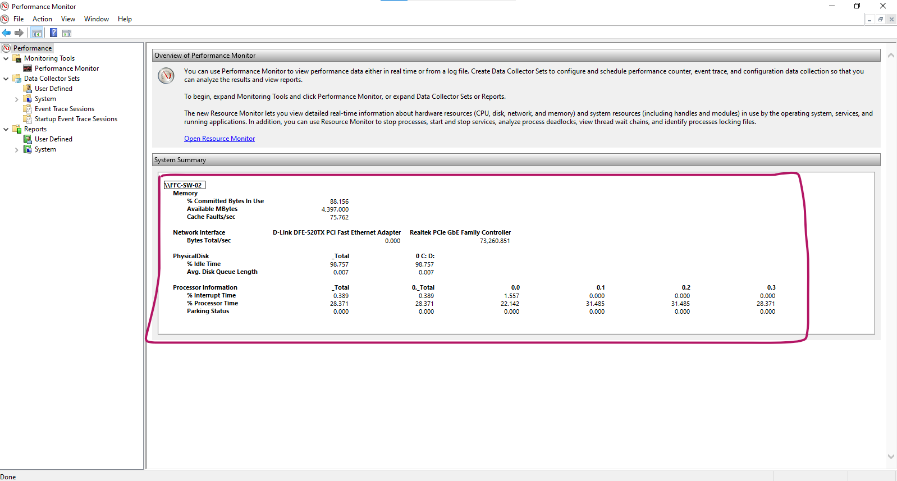
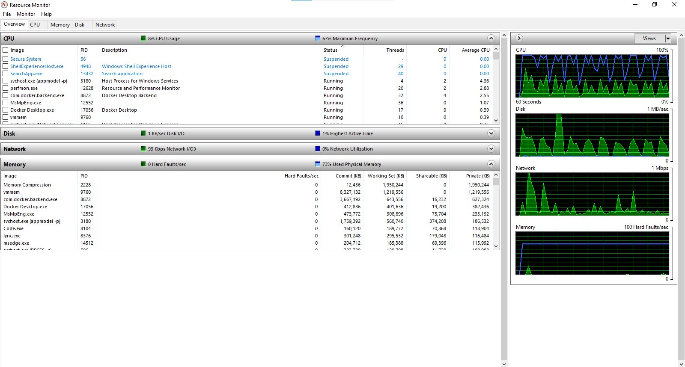

# PerformanceCounters

> __Rrefrence__: [Performance counters in .NET Framework](https://learn.microsoft.com/en-us/dotnet/framework/debug-trace-profile/performance-counters)

## Performance counters `categories`
- [Exception performance counters](#exception-performance-counters)
- [Interop performance counters](#interop-performance-counters)
- [JIT performance counters](#jit-performance-counters)
- [Loading performance counters](#loading-performance-counters)
- [Lock and thread performance counters](#lock-and-thread-performance-counters)
- [Memory performance counters](#memory-performance-counters)
- [Networking performance counters](#networking-performance-counters)
- [Security performance counters](#security-performance-counters)

## Runtime Profiling
- [Tracking Performance Using the Performance Monitor (Perfmon.exe)](https://learn.microsoft.com/en-us/dotnet/framework/debug-trace-profile/runtime-profiling#tracking-performance-using-the-performance-monitor-perfmonexe)
```
The Performance Monitor is the easiest tool to use to profile your .NET Framework application. The Performance Monitor graphically represents data found in the .NET Framework performance counters that are installed with the common language runtime and the Windows SDK. These counters can be used to monitor everything from memory management to just-in-time (JIT) compiler performance. They tell you about the resources your application uses, which is an indirect measure of your application's performance. Use these counters to understand how your application works internally.
```
### Exception performance counters
> `Ref:` [Exception performance counters](https://learn.microsoft.com/en-us/dotnet/framework/debug-trace-profile/performance-counters#exception-performance-counters)
### Interop performance counters
> `Ref:` [Interop performance counters](https://learn.microsoft.com/en-us/dotnet/framework/debug-trace-profile/performance-counters#interop-performance-counters)
### JIT performance counters
> `Ref:` [JIT performance counters](https://learn.microsoft.com/en-us/dotnet/framework/debug-trace-profile/performance-counters#jit-performance-counters)
### Loading performance counters
> `Ref:` [Loading performance counters](https://learn.microsoft.com/en-us/dotnet/framework/debug-trace-profile/performance-counters#loading-performance-counters)
### Lock and thread performance counters
> `Ref:` [Lock and thread performance counters](https://learn.microsoft.com/en-us/dotnet/framework/debug-trace-profile/performance-counters#lock-and-thread-performance-counters)
### Memory performance counters
> `Ref:` [Memory performance counters](https://learn.microsoft.com/en-us/dotnet/framework/debug-trace-profile/performance-counters#memory-performance-counters)
### Networking performance counters
> `Ref:` [Networking performance counters](https://learn.microsoft.com/en-us/dotnet/framework/debug-trace-profile/performance-counters#networking-performance-counters)
### Security performance counters
> `Ref:` [Security performance counters](https://learn.microsoft.com/en-us/dotnet/framework/debug-trace-profile/performance-counters#security-performance-counters)

## Summary indicators



